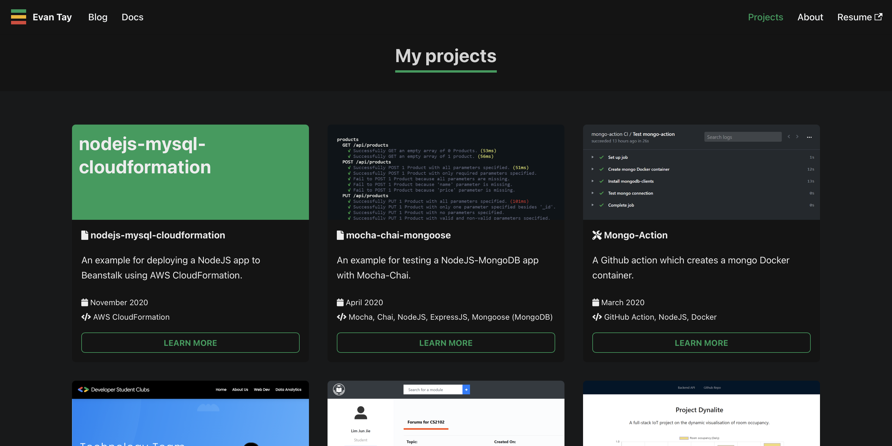

<h1 align="center">
  kaya-folio
</h1>

  <b>Personal portfolio website, with <a href="https://lmgtfy.app/?q=kaya">kaya</a></b>

  Second iteration of <a href="https://evantay.com" target="_blank">evantay.com</a> built with <a href="https://v2.docusaurus.io/">Docusaurus v2</a> and <a href="https://reactjs.org/">ReactJS</a>

  Previous version: <a href="https://github.com/DigiPie/evantay.com" target="_blank">evantay.com (1.0)</a>

 

## Design motivation

The website should prioritise accessibility over aesthetics, and be easy to maintain and use.

## How was this built

The Blog and Docs pages are provided by [Docusaurus v2](https://v2.docusaurus.io/).

As for the Landing, Projects and About pages, I built them using [ReactJS](https://reactjs.org/).

## Can I use this

I built this website for my own personal use but you are free to use it as long as you credit me. You can do so by linking back to [evantay.com](https://evantay.com/) :relaxed: Cheers!
