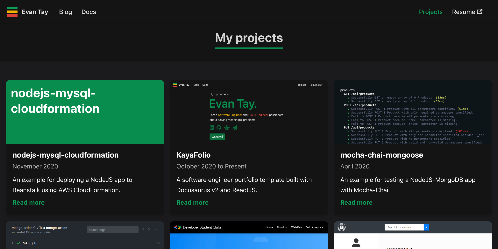

<h1 align="center">
  KayaFolio
</h1>

  A software engineer portfolio template built with <a href="https://docusaurus.io">Docusaurus 3.0</a>, <a href="https://reactjs.org/">ReactJS</a>, and <i><a href="https://www.google.com/search?q=kaya">Kaya</a></i>.

 

## Design motivation

  <i>Accessibility over aesthetics</i>

  <i>Easy to maintain and extend code and content</i>

  <i>Comfortable to use on both web and mobile</i>

## How was this built

The Blog and Docs pages come pre-built with [Docusaurus 3.0](https://docusaurus.io).

As for the Landing and Projects pages, I built them using [ReactJS](https://reactjs.org/).

## Can I use this

I wrote this template for my own use but you are free to use it as long as you credit me. You can do so by linking back to [evantay.com](https://evantay.com/) :relaxed: Cheers!
