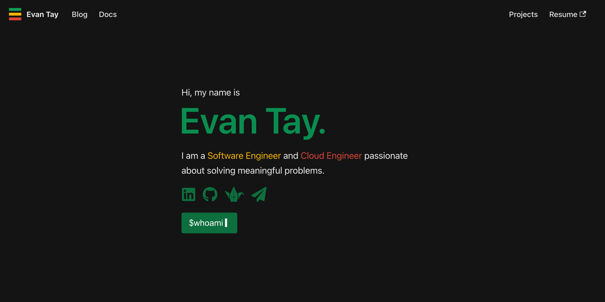

<h1 align="center">
  evantay.com: kaya-folio (2.0)
</h1>

  <b>Personal portfolio website, with <a href="https://lmgtfy.app/?q=kaya">kaya</a>.</b>

  The second iteration of <a href="https://evantay.com" target="_blank">evantay.com</a> built with <a href="https://v2.docusaurus.io/">Docusaurus v2</a> and <a href="https://reactjs.org/">ReactJS</a>.

  Previous version: <a href="https://github.com/DigiPie/evantay.com" target="_blank">evantay.com (1.0)</a>

## Design motivation

The website should:

- Be easy to maintain and extend for both code and content
  - De-couple code and content whenever possible
  - Create reusable components for code blocks which are repeated
- Put communication first, and design second
  - Avoid trading content accessibility for cooler design
  - Adopt a minimalistic design

## How was this built

The Blog and Docs pages of [kaya-folio](https://github.com/DigiPie/kaya-folio) are provided by [Docusaurus v2](https://v2.docusaurus.io/). All I had to do was write my blog posts and documentation in Markdown for those two sections.

"[Docusaurus v2](https://v2.docusaurus.io/) allows you to extend or customize your project's layout by reusing React."

As for the Landing, Projects and About pages, I built them using [ReactJS](https://reactjs.org/).

## Can I use it

I built this website for my own personal use, but you are free to use it so long as you credit me. You can do so by linking back to [evantay.com](https://evantay.com/). :relaxed:

## Projects page

## About page

